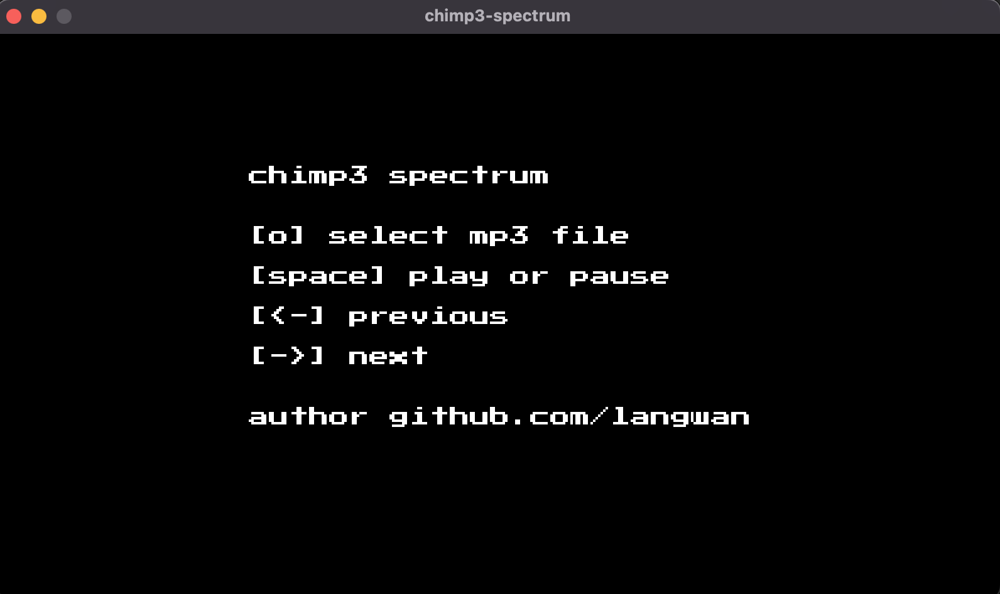

# chimpy-specturm

An audio spectrum visualizer built with golang

## lib

[go-mp3] https://github.com/hajimehoshi/go-mp3
[oto] https://github.com/hajimehoshi/oto
[ebiten] https://ebitengine.org/
[go-dsp] https://github.com/goccmack/godsp